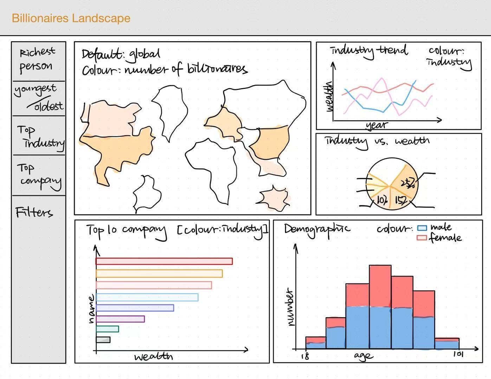

# Billionaires Landscape Dashboard
A data exploration tool that uses ***billionaire_statistics*** to help users understand **wealth distribution, industry dominance, and demographic patterns** among the world’s billionaires. It includes a variety of **interactive features**, such as:

## Dashboard Features

### Summary Statistics
Provides key **insights into the billionaire landscape**, including:

- **Richest Person:** Name and final worth of the world's wealthiest billionaire.
- **Youngest & Oldest Billionaires:** Age details for the youngest and oldest billionaires.
- **Top Industry:** The industry that has the highest billionaire wealth concentration.
- **Top Company:** The company with the highest billionaire wealth.

### Choropleth Map: Billionaire Density by Country
Displays the **global distribution of billionaires**, where **colour intensity** represents the **number of billionaires** per country.

- **Filters** allow users to focus on **specific countries**.

### Industry Trend Line Chart
Shows how **billionaire wealth trends over time**.

- The X-axis represents **time (years)**, and the Y-axis represents **total billionaire wealth**.
- Lines are **colour-coded by industry**, making it easy to compare industry growth.

### Industry Wealth Distribution Pie Chart
Represents the **proportion of billionaire wealth per industry**.

- Allows users to see **which industries dominate global/country wealth**.

### Top 10 Companies Bar Chart
Displays the **top 10 companies with the highest billionaire wealth**.

- **Colour-coded by industry**, making it easy to see industry concentration in top companies.

### Demographic Distribution Histogram
Visualizes **billionaire age distribution**, with colour-coded bars for **male and female billionaires**.

- Helps understand **age demographics among billionaires**.

## Interactivity & Filters
All charts are **interactive** and allow users to:

- **Filter by Country**: Selecting a country updates all other visualizations.
- **Industry Selection**: Users can focus on specific industries to analyze trends.

## Example Sketch
